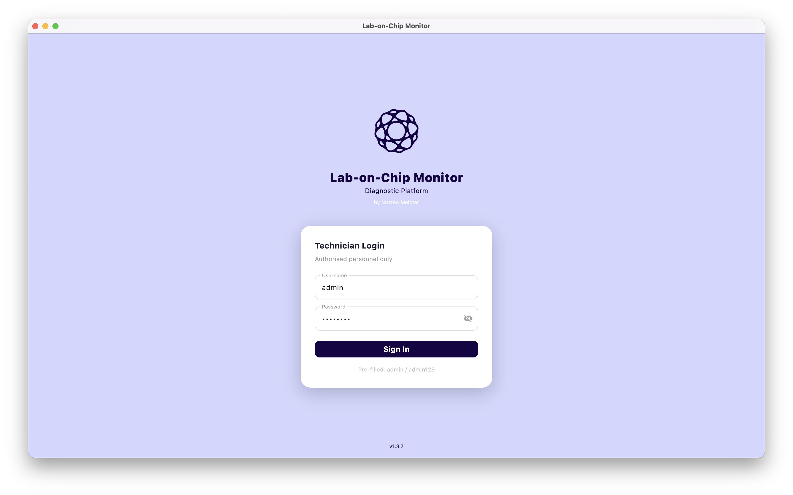
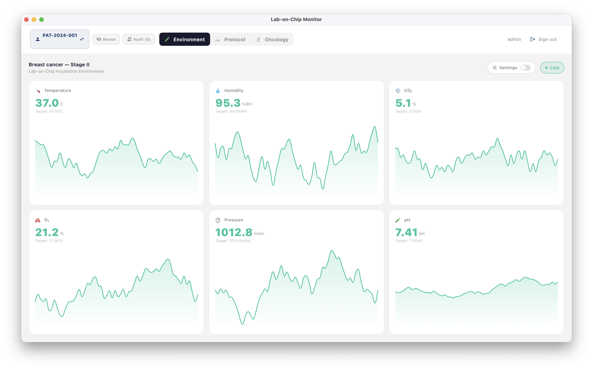
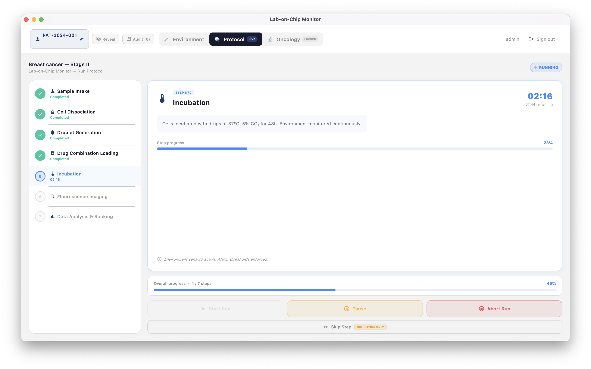
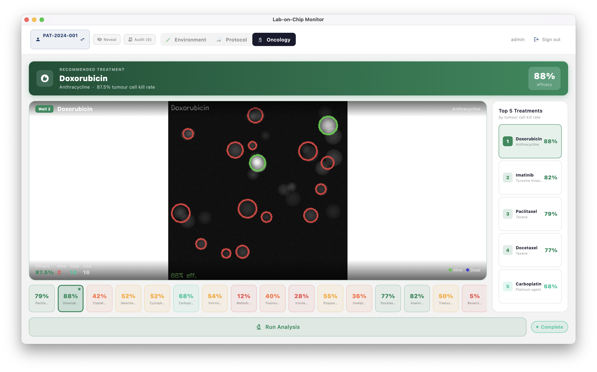
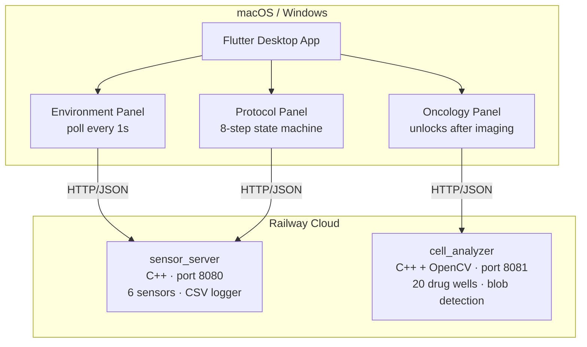
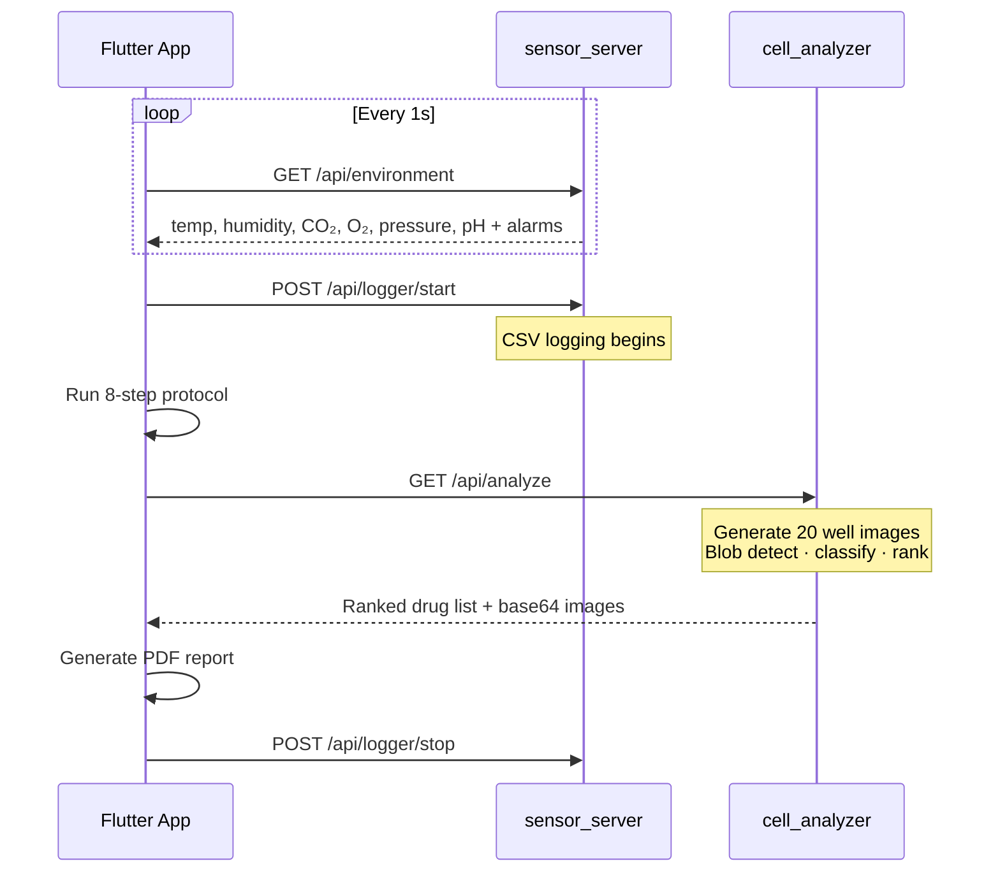

# Lab-on-Chip Monitor

A full-stack simulation of a **lab-on-chip medical device** for personalised cancer treatment. A C++ backend simulates hardware sensors and runs computer-vision drug efficacy analysis. A Flutter desktop app provides a real-time clinical dashboard.

---

## Download

👉 **[Latest Release](https://github.com/matteomeister-engineer/lab-on-chip-monitor/releases/latest)**

| Platform | File | Instructions |
|---|---|---|
| **macOS** | `Lab-on-Chip-Monitor-macOS.dmg` | Open → drag app to Applications → right-click → Open |
| **Windows** | `Lab-on-Chip-Monitor-Windows.zip` | Extract → run `lab_on_chip_monitor.exe` |

> No setup needed. No Docker. No terminal. The app connects automatically to cloud backends.

> **Login:** `admin` / `admin123`

> **macOS:** Right-click the app → **Open** the first time to bypass Gatekeeper.

> **First launch:** Cloud backends may take 10–20 seconds to wake up. If you see "Disconnected", wait a moment.

---

## Screenshots

The login screen with a slowly rotating logo animation.

Real-time incubation environment monitoring across 6 sensors, updated every second.

8-step automated protocol state machine with live progress tracking.

OpenCV-based oncology analysis ranking 20 drugs by tumour cell kill rate.

---

## What it does

The app simulates a microfluidic lab-on-chip device that tests 20 cancer drugs on a patient's cell sample simultaneously, ranking them by efficacy using computer vision.

**1. Environment Monitor** — real-time sensor dashboard polling 6 incubation sensors every second (temperature, humidity, CO₂, O₂, pressure, pH). Alarms trigger if values drift outside safe ranges. Sensor targets are adjustable. All readings are CSV-logged.

**2. Protocol Run** — 8-step automated protocol state machine (cell intake → dissociation → droplet generation → drug loading → incubation → imaging → analysis → report). Each step shows a live animation and progress bar. Generates a PDF report on completion.

**3. Oncology Analysis** — unlocks after the imaging step. Runs OpenCV-based blob detection on 20 synthetic microscopy well images to count live vs dead cells per drug, then ranks all 20 drugs by efficacy.

---

## Architecture

---

## Data Flow

---

## Tech Stack

| Layer | Technology |
|---|---|
| Frontend | Flutter (Dart), fl_chart, pdf, window_manager |
| Sensor backend | C++17, httplib, mean-reversion noise model |
| Vision backend | C++17, OpenCV 4 — SimpleBlobDetector |
| Deployment | Docker → Railway cloud |
| CI/CD | GitHub Actions → .dmg + .exe releases |

---

Built by **Mattéo Meister** · [meister.matteo@outlook.com](mailto:meister.matteo@outlook.com) · [GitHub](https://github.com/matteomeister-engineer)