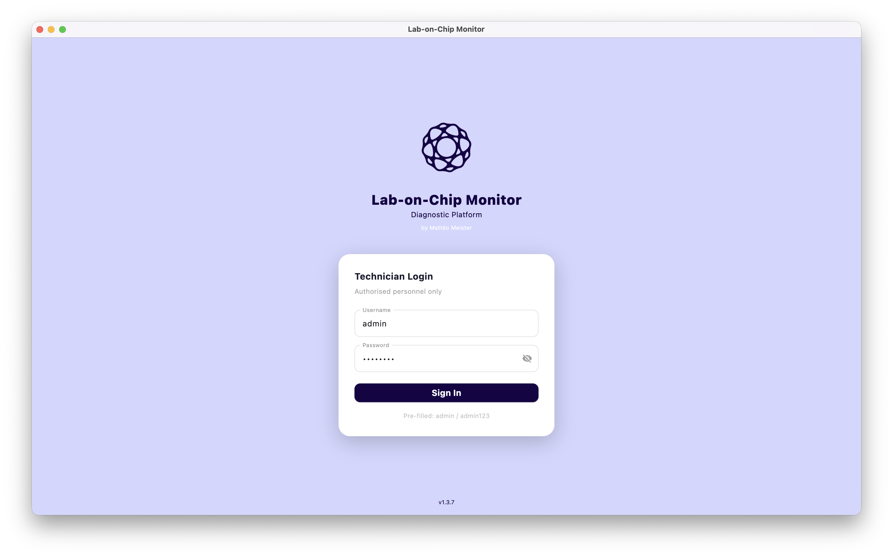
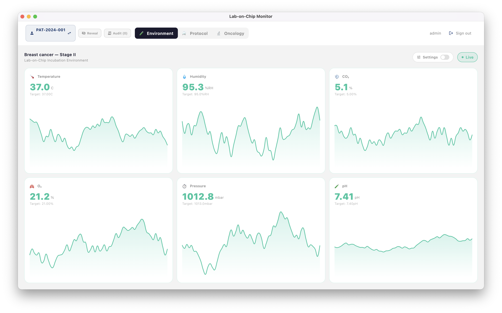
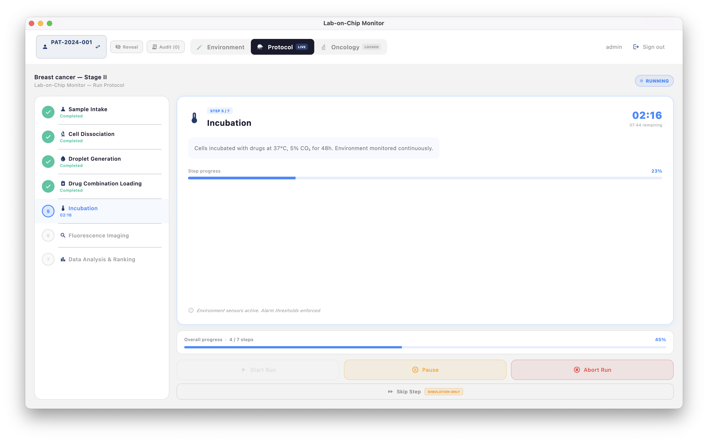
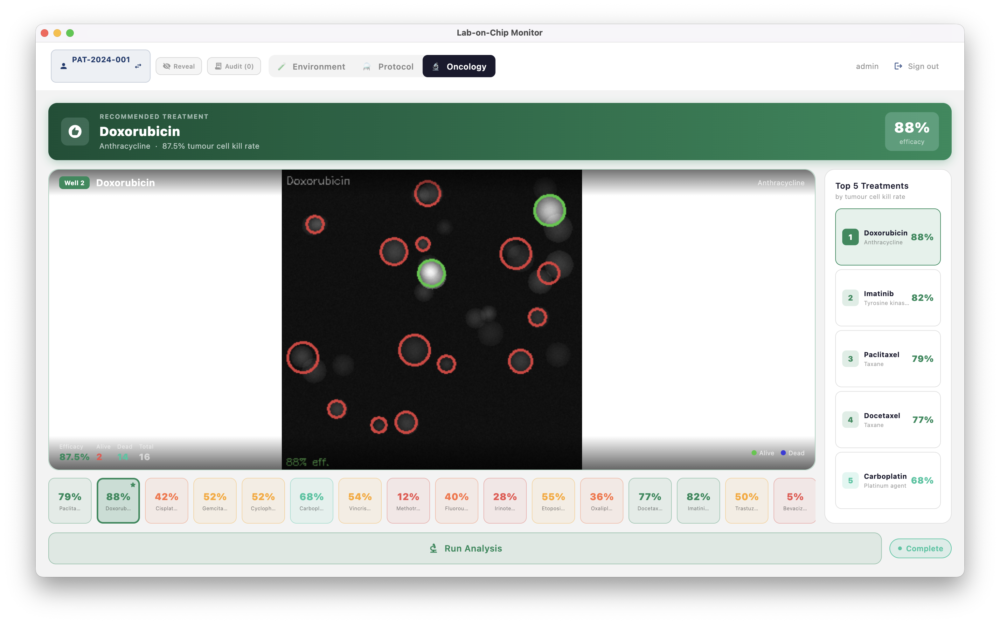
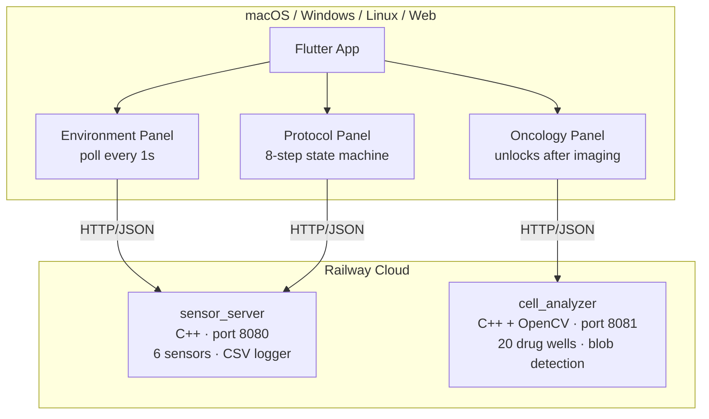
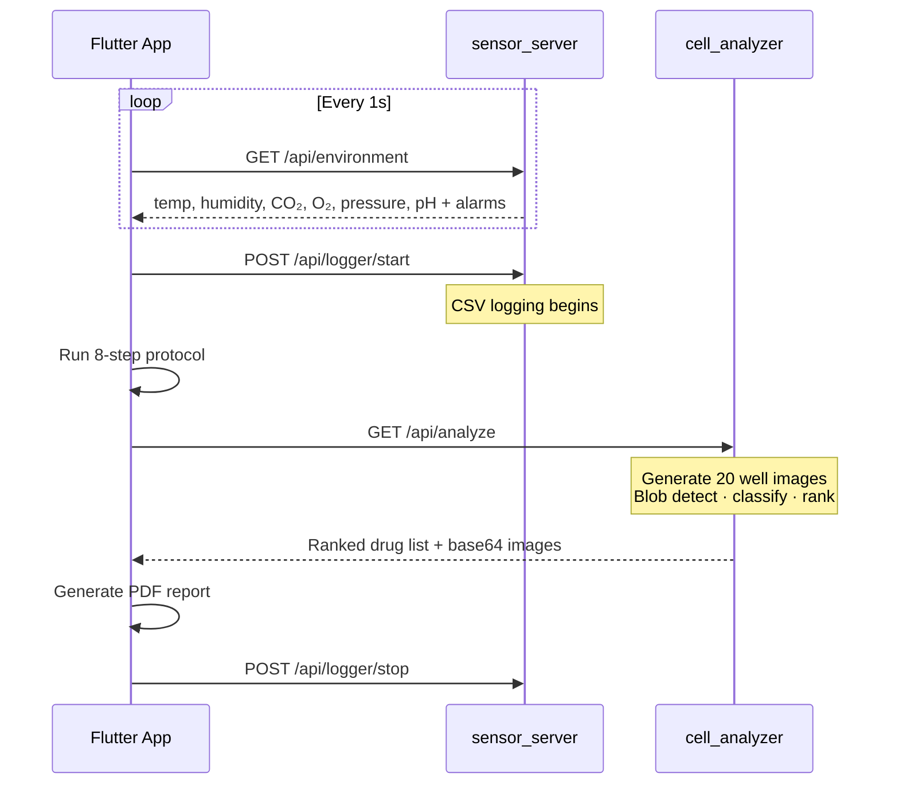

# Lab-on-Chip Monitor

A full-stack simulation of a **lab-on-chip medical device** for personalised cancer treatment. A C++ backend simulates hardware sensors and runs computer-vision drug efficacy analysis. A Flutter desktop app provides a real-time clinical dashboard.

---

## 🌐 Try it online

**No installation needed** — runs directly in your browser.

👉 **[Launch Web App](https://matteomeister-engineer.github.io/lab-on-chip-monitor/)**

> **Login:** `admin` / `admin123`

> Cloud backends may take **10–20 seconds to wake up** on first load. If you see "Disconnected", wait a moment and the app will connect automatically.

---

## Download

Prefer a native desktop experience? Download the latest release below.

👉 **[Latest Release](https://github.com/matteomeister-engineer/lab-on-chip-monitor/releases/latest)**

| Platform | File | Instructions |
|---|---|---|
| **macOS** | `Lab-on-Chip-Monitor-macOS.dmg` | Open → drag app to Applications → right-click → Open |
| **Windows** | `Lab-on-Chip-Monitor-Windows.zip` | Extract → run `lab_on_chip_monitor.exe` |
| **Linux x64** | `Lab-on-Chip-Monitor-Linux-x64.tar.gz` | Extract → run `bundle/lab_on_chip_monitor` |
| **Linux ARM64** | `Lab-on-Chip-Monitor-Linux-arm64.tar.gz` | For Apple Silicon UTM / ARM devices |

> No setup needed. No Docker. No terminal. The app connects automatically to cloud backends.

> **macOS:** Right-click the app → **Open** the first time to bypass Gatekeeper.

---

## Screenshots

 Login screen.

 

 Real-time incubation environment monitoring across 6 sensors, updated every second.

 

 8-step automated protocol state machine with live progress tracking.

 

 OpenCV-based oncology analysis ranking 20 drugs by tumour cell kill rate.

---

## What it does

The app simulates a microfluidic lab-on-chip device that tests 20 cancer drugs on a patient's cell sample simultaneously, ranking them by efficacy using computer vision.

**1. Environment Monitor** — real-time sensor dashboard polling 6 incubation sensors every second (temperature, humidity, CO₂, O₂, pressure, pH). Alarms trigger if values drift outside safe ranges. Sensor targets are adjustable. All readings are CSV-logged.

**2. Protocol Run** — 8-step automated protocol state machine (cell intake → dissociation → droplet generation → drug loading → incubation → imaging → analysis → report). Each step shows a live animation and progress bar. Generates a PDF report on completion.

**3. Oncology Analysis** — unlocks after the imaging step. Runs OpenCV-based blob detection on 20 synthetic microscopy well images to count live vs dead cells per drug, then ranks all 20 drugs by efficacy.

---

## Architecture

```mermaid
graph TB
    subgraph Desktop["macOS / Windows / Linux / Web"]
        App["Flutter App"]
        P1["Environment Panel\npoll every 1s"]
        P2["Protocol Panel\n8-step state machine"]
        P3["Oncology Panel\nunlocks after imaging"]
        App --> P1
        App --> P2
        App --> P3
    end

    subgraph Cloud["Railway Cloud"]
        S1["sensor_server\nC++ · port 8080\n6 sensors · CSV logger"]
        S2["cell_analyzer\nC++ + OpenCV · port 8081\n20 drug wells · blob detection"]
    end

    P1 -->|HTTP/JSON| S1
    P2 -->|HTTP/JSON| S1
    P3 -->|HTTP/JSON| S2
```

---

## Data Flow

```mermaid
sequenceDiagram
    participant App as Flutter App
    participant Env as sensor_server
    participant Cell as cell_analyzer

    loop Every 1s
        App->>Env: GET /api/environment
        Env-->>App: temp, humidity, CO₂, O₂, pressure, pH + alarms
    end

    App->>Env: POST /api/logger/start
    Note over Env: CSV logging begins

    App->>App: Run 8-step protocol

    App->>Cell: GET /api/analyze
    Note over Cell: Generate 20 well images<br/>Blob detect · classify · rank
    Cell-->>App: Ranked drug list + base64 images

    App->>App: Generate PDF report
    App->>Env: POST /api/logger/stop
```

---

## Tech Stack

| Layer | Technology |
|---|---|
| Frontend | Flutter (Dart) — desktop + web, fl_chart, pdf, window_manager |
| Sensor backend | C++17, httplib, mean-reversion noise model |
| Vision backend | C++17, OpenCV 4 — SimpleBlobDetector |
| Deployment | Docker → Railway cloud |
| CI/CD | GitHub Actions → .dmg + .exe + web (GitHub Pages) |

---

Built by <b>Mattéo Meister</b> · <a href="mailto:meister.matteo@outlook.com">meister.matteo@outlook.com</a> · <a href="https://github.com/matteomeister-engineer">GitHub</a>

